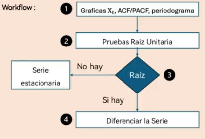
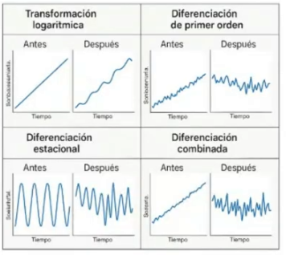

# Series de tiempo

## Procesos determinísticos vs procesos estocásticos

| Aspecto | Proceso deterministico | Proceso estocastico |
| --- | --- | --- |
| Definicion | Es aquel en el que los valores futuros de la variable están completamente determinados por una relación funcional o una regla matemática, **sin intervención del azar** | Es un proceso donde los valores futuros dependen del azar, están sujetos a **variaciones aleatorias** que no pueden predecirse con exactitud |
| Caracteristicas | - Si se conocen las condiciones iniciales y las ecuaciones del modelo, se puede predecir exactamente el valor futuro. - No existe variabilidad aleatoria: el resultado es unico y reproducible. | - Se modela como una coleccion de variables aleatorias indexadas en el tiempo. - Se describe el comportamiento probabilistico del sistema. - Importancia de la distribucion de probabilidades y la dependencia temporal. |
| Ejemplo | Modelos físicos| Modelos donde siempre hay incertidumbre en la evolución de la variable |

## Definicíon de series de tiempo

Secuencia de observaciones indexadas por el tiempo, donde se representa el conjunto de indices temporales:
- Predicciones climáticas.
- Análisis de cotizaciones bursátiles.
- Seguimiento de variables demográficas.
- Estudios económicos.
- Mediciones de procesos industriales.

El objetivo principal del análisis de series de tiempo es modelar la dependencia temporal entre las observaciones, es decir, para diferentes valores de rezago.

| Ejemplo 1 | Ejemplo 2 |
| --- | --- |
|  |  |

## Metodología para abordar un problema de series de tiempo
**Enfoque Box-Jenkins**

| 1.Definición del objetivo | 2.Revisión y limpieza | 3.Visualización y exploración | 4.Estacionariedad y transformaciones |
| --- | --- | --- | --- |
| ¿Qué buscas? | Verificar: | Exploración gráfica: | Verificar:|
|- ¿Pronosticar valores futuros?.  - Entender la dinámica interna (autocorrelación, estacionalidad, shocks).  - Te interesa el comportamiento medio, la varianza. | - Frecuencia.  - Periodo curbierto(ventana de observación).  - Unidades de medida.  - Presencia de valores faltantes o duplicados.  - Cambios estructurales. | - Serie original(tendencia, estacionalidad, cambios estructurales).  - Zoom por años o meses.  - Diferentes escalas o transformaciones. | - Graficos: media y varianza a lo largo del tiempo.  - Test formales (Dickey-Fuller aumentado - ADF, KPSS, Phillips-Perron) |

- **5.Elección del modelo**
- **6.Diagnóstico de Residuos**
- **7.Pronóstico y evaluación**
- **8.Reportes**

## Propiedades de las series de tiempo

### Tendencia *
- Movimiento de largo plazo (creciente o decreciente) que refleja la evolución general de la serie

### Estacionalidad *
- Variaciones periodicas de corto plazo asociadas al calendario (meses, estaciones, dias)

### Ruido aleatorio *
- Componente impredecible ocasionado por eventos azarosos, errores de medición u otras irregularidades.

### Variación cíclica -
- Oscilaciones de largo plazo relacionadas con ciclos económicos o sociales de duración variable.

### Variación transitoria -
- Fenómeto aislados que alteran temporalmente el comportamiento (cambios estructurales).

### Estacionariedad -
- Propiedad de la serie donde la media y la varianza son constantes;; no hay tendencia ni estacionalidad. (modelos lineales de autoregresión y de medias moviles  - AR MA -)

| img1 | img2 | img3 |
| --- | --- | --- |
|  |  |  |

## Descomposición de las series

La descompocisión separa la serie observada $Y_t$ en componentes interpletables:

- Tendencia/ciclo $T_t$
- Estacionalidad $S_t$: patrón repetitivo con periodo $s$
- Resto $R_t$: ruido y eventos idiosincrpaticos

### Formas del modelo:
- Aditivo (conserva la estacionariedad ARIMA, SARIMA, AR, MA): $Y_t = T_t + S_t + R_t$
- Multiplicativo (modelos no lineales): $Y_t = T_t \times S_t \times R_t$
- Equivalente aditivo en log: $log(Y_t) = log(T_t) + log(S_t) + log(R_t)$

*nota*: Si la estacionalidad aumenta con el nivel, use multiplicativo.

### Pasos de la descomposición de series temporales.
- *Paso 0.* Preparación
- *Paso 1.* Estimar la tendencia $T_t$
- *Paso 2.* Quitar tendencia para aislar estacionalidad
- *Paso 3.* Estimar estacionalidad $S_t$
- *Paso 4.* Obtener el respo $R_t$
- *Paso 5.* Diagnóstico
- *Paso 6.* Reconstrucción $Y_t = T_t + S_t + R_t$

## Concepto de raíz unitaria

La **raíz unitaria** es el concepto central para distinguir series no estacionarias con tendencia estocástica de las estacionarias.
*Concecuencias de tener raíz unitaria:*
- **No estacionariedad:** Media y varianza dependen de t.
- **Persistencia permanente:** los chiques no se disipan; la respuesta al impulso no es sumable.
- **Regresiones espurias:** Resultados sin significancia estadística.

**Prueba de Raiz Unitaria:**
- Regresión Dickey-Fuller ampliada (ADF)
- KPSS: nulo de estacionariedad (lo opuesto a ADF)
- Phillips-Perron (PP)

nota: Si yo tengo raices unitarias, entonces compruebo que la serie no es estacionaria (lo que pasa la mayoría de las veces), entonces debo entrar a transformar la serie en una serie estacionaria.

## Transformaciones y Diferenciación

**Transformaciones** ---> Estabilizar la varianza.

**Diferenciaciones**  ---> Eliminar tendencias y raíces unitarias.

| Problema | Síntoma | Transformación recomendada |
| --- | --- | --- |
| Varianza creciente | Aumentos proporcionales| Log o Box-Box |
| Tendencia lineal | ACF decae lentamente | Diferencia de primer orden |
| Tendencia cuadrática | ACF muy persistente | Diferencia de segundo orden |
| Estacionalidad | Picos ACF en multiplos de s | Diferencia estacional |
| Cambios de nivel abruptos | Media no constante | Diferencia regular |
| Volatilidad agrupada | Varianza condicional variable | Modelos GARCH (no solo transformaciones) |

## Autocorrelación

Medida estadistica que indica el grado de relación entre los valores de una serie de tiempo y sus propios valores pasados:

- **Autocorrelación Alta:** Valores actuales dependen fuertemente de los anteriores.
- **Cercana a cero:** Los valores son prácticamente independientes.

### Herramientas para identificar Autocorrelación:

1. Función de Autocorrelación (ACF).
2. Función de Autocorrelación Parcial (PACF).
3. Pruebas estadísticas.
4. Inspección visual.

#### ACF:
Mide la correlación lineal entre los valores de la serie y sus rezagos temporales.

**Interpretar el patrón**:
- Si varías barras están fuera del intervalo -> existe autocorrelación significativa.
- Si decae lentamente -> La serie no es estacionaria
- Si decae rápidamente a cero -> La serie es estacionaria.

#### PACF:
Mide la correlación lineal entre los valores de la serie y susu rezagos temporales (casi siempre se analizan los primeros 50 lags).

**Interpretar el patrón**:
- Un corte brusco (spike) en el rezago p sugiere un modelo AR(p)
- Un decaiminento gradual sugiere un modelo MA(q) o mezcA ARMA

#### ACF Y PACF

## Ruido blanco:
Una serie ${\varepsilon_t}$ es ruido blanco si:
- $E(\varepsilon_t) = 0$
- $Var(\varepsilon_t) = \sigma^2 < \infty$
- $Cov(\varepsilon_t, \varepsilon_{t-h}) = 0$

Algunas características:
- En series financieras, los residuos suelen mostrar volatilidad agrupada (heterocedasticidad).
- Anque la media siga un modelo ARMA, los residuos no son ruido blanco gaussiano, sino ruido blanco con varianza condicional (base de los modelos ARCH/GARCH)

**Ruido blanco fuerte**: Si ${\varepsilon_t} \sim \mathcal{N}(0, \sigma^2) $ i.i.d, es ruido blanco gaussiano.

En los modelos clásicos de series de tiempo (AR, MA, ARMA, ARIMA, SARIMA, etc), se espera que los residuales sean un ruido blanco gaussiano.

